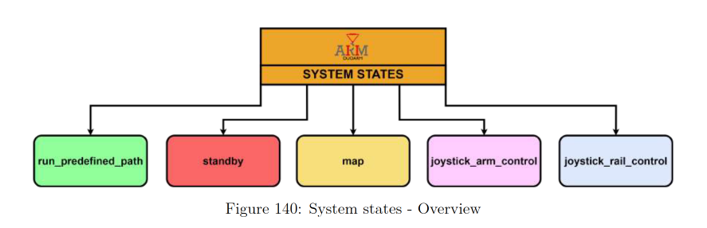
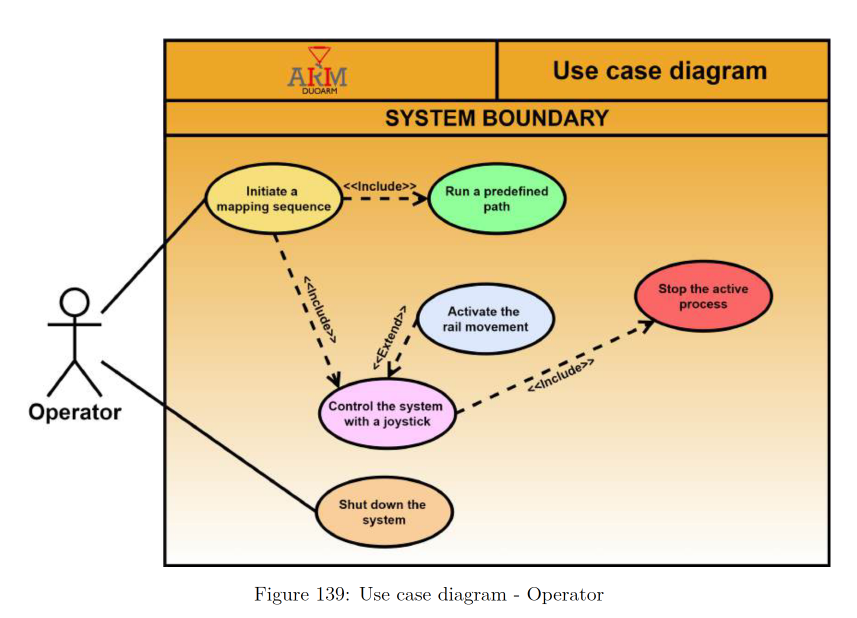
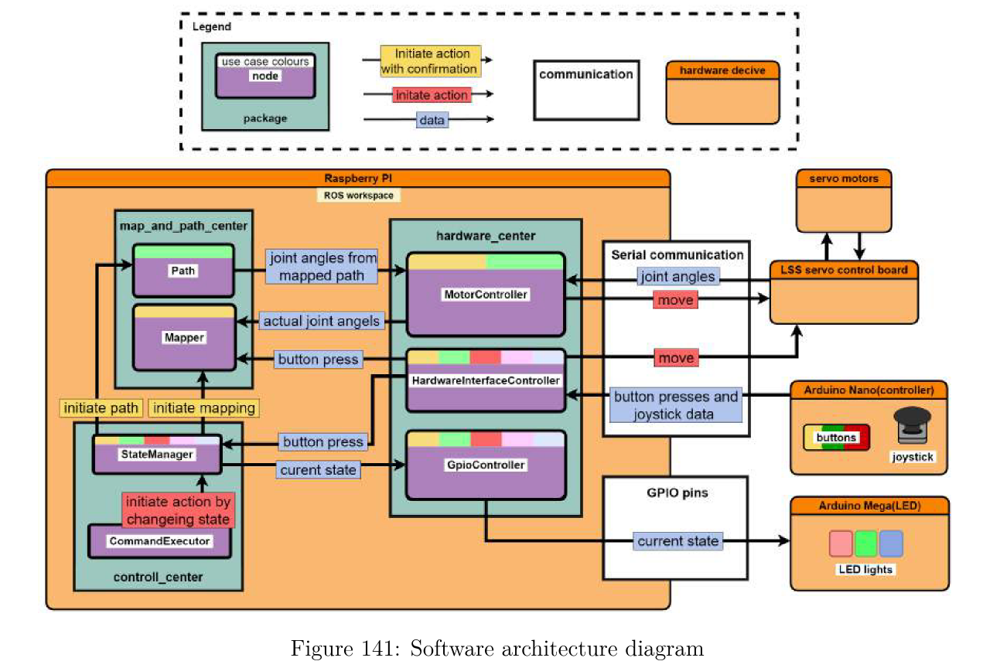

# ROS 2 Bachelor Thesis – DuoArm System

This repository contains the full software stack developed as part of a bachelor thesis focused on **ROS 2-based modular system design**, hardware integration, and state-driven control for the *DuoArm* robotic platform.

The project demonstrates structured and modular software engineering practices applied to robotics, including modular architecture, encapsulation, explicit state management, and robust communication across heterogeneous hardware components.

**The full report can be found at in the repo root.**

---

## 1. Project Overview

The DuoArm system is a ROS 2–based robotic control platform consisting of:

* A **Raspberry Pi** running ROS 2
* Multiple **microcontrollers (Arduino Nano & Mega)**
* **LSS-HS1 servo motors** with an LSS adapter board
* A **joystick-based user interface** with buttons
* **LED-based system state feedback**

The system supports:

* Mapping sequences
* Manual joystick control of the robotic arm and rail
* Execution of predefined paths
* Safe state transitions and shutdown

All functionality is orchestrated through explicit **system states** and **use cases**, ensuring deterministic behavior and maintainability.

---

## 2. System States

The system operates using a finite set of high-level states:

* `standby`
* `map`
* `joystick_arm_control`
* `joystick_rail_control`
* `run_predefined_path`

These states define *what the system is allowed to do* at any given time and act as the backbone of system safety and flow control.

**Figure 140: System states – Overview** illustrates the relationship between these states and how the operator transitions between them.

---

## 3. Use Case–Driven System Flow

The system behavior is derived directly from the operator use cases (Figure 139).

### Initial System Launch (No Mapping Data)

At first launch, no valid mapping data exists. The operator therefore has one primary entry action:

* **Initiate a mapping sequence**

This mapping step is mandatory before the operator can:

* Control the system using a joystick (`joystick_arm_control` or `map` state)
* Run a predefined path (`run_predefined_path` state)

This dependency is modeled using **«include» relationships** in the use case diagram.

### Post-Mapping Behavior

Once a mapping sequence is completed:

* The system transitions to `standby`
* The operator may freely choose between:

  * `joystick_arm_control`
  * `run_predefined_path`
  * Returning to `map` for a new mapping sequence

From `joystick_arm_control`, the operator may:

* Activate the rail system (**«extend» dependency**)
* Stop the active process, which always routes the system back to `standby` (**«include» dependency**)

### Subsequent Launches

After a reboot, previously stored mapping data is loaded automatically. The operator can immediately select:

* `joystick_arm_control`
* `run_predefined_path`
* `map`

without repeating the initial mapping sequence.

**Figure 139: Use case diagram** visualizes the actions a user can make on the system.

---

## 4. Software Architecture & Design Principles

### 4.1 Design Philosophy – Modularity Through Encapsulation

A key architectural principle applied throughout development is **modularity through encapsulation**.

Encapsulation ensures that:

* Each component (ROS node) is responsible for a *single, well-defined role*
* Internal state and behavior are isolated
* Errors in one component have minimal impact on others
* Components are reusable and easy to replace

This principle significantly improves robustness, scalability, and maintainability of the system.

---

## 5. ROS 2 Package Structure

In ROS terminology, components are implemented as **nodes**, grouped into **packages** based on responsibility.

The DuoArm system consists of three primary packages:

### 5.1 `hardware_center`

Responsible for all hardware interaction, including:

* Servo motor control
* Serial communication with microcontrollers
* GPIO signaling

Key nodes:

* `MotorController`
* `HardwareInterfaceController`
* `GpioController`

---

### 5.2 `control_center`

Responsible for system logic and orchestration:

* State management
* Command execution
* System flow control
* Informative logging

Key nodes:

* `StateManager`
* `CommandExecutor`

---

### 5.3 `map_and_path_center`

Responsible for spatial logic:

* Mapping
* Path generation
* Path execution

Key nodes:

* `Mapper`
* `Path`

---

**Figure 141: Software architecture diagram** visualizes the complete ROS 2 system, including package boundaries, node interactions, and hardware interfaces.

---

## 6. Configuring Use Case Events

To clearly define execution conditions and dependencies, an **overarching use case table** was created.

This table:

* Assigns unique identifiers to each use case
* Maps all preconditions and triggering events
* Uses color coding to show relationships between events and use cases
* Highlights shared events across multiple use cases

The table serves as a traceability tool between:

* High-level requirements
* Use cases
* System states
* Low-level implementation

---

## 7. Communication & Data Transmission

### 7.1 Raspberry Pi ↔ LSS Motors

Communication between:

* Raspberry Pi
* LSS adapter board
* LSS-HS1 servo motors

is implemented using the **official LSS Python libraries**.

Key characteristics:

* Each motor is assigned a unique ID stored in EEPROM
* USB port configuration is defined globally
* Motor objects encapsulate all servo behavior

---

### 7.2 Raspberry Pi ↔ User Interface Controller

Communication with the joystick and buttons (Arduino Nano) uses **pySerial**.

Key design considerations:

1. **Debounced input handling**

   * Button presses (short or long) register as a single event
2. **Real-time feedback**

   * Continuous joystick updates without blocking execution

Challenges addressed:

* Serial desynchronization after ROS restarts
* Invalid byte reads and crashes

Final solution:

* Human-readable `print()`-based serial transmission
* Newline-delimited messages
* Non-blocking timing using `millis()`
* Edge-based button detection
* Input buffer reset on ROS node startup

---

### 7.3 LED State Feedback System

LEDs provide visual feedback corresponding to the active system state.

Final architecture:

* Raspberry Pi GPIO → Arduino Mega → LEDs
* Avoids brightness and power issues encountered with direct GPIO and PWM control

Implementation details:

* `GpioController` subscribes to the `system_state` topic
* State changes trigger GPIO output combinations
* Arduino Mega decodes combinations using a switch-case structure
* Analog outputs drive the LEDs

This design ensures:

* Clear visual system feedback
* Hardware isolation
* Reliable operation across reboots

---

## 8. Summary

This project presents a **structured ROS 2 system design** with a strong focus on:

* Explicit state-driven control
* Use case–based system modeling
* Modular, encapsulated architecture
* Robust serial and GPIO communication
* Maintainable and scalable robotics software

The repository is intended both as:

* A functional robotics control system
* A reference example for ROS 2–based embedded robotics projects

---

## 9. References

Relevant references are cited in the thesis report and associated appendices, including:

* ROS 2 documentation
* LSS motor libraries
* pySerial documentation
* Embedded systems communication best practices
